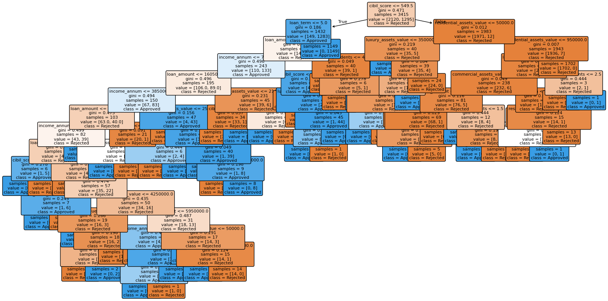
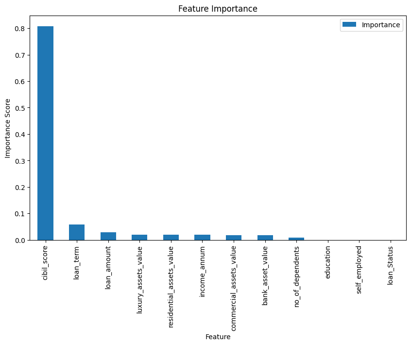

# Loan Approval Prediction using Decision Tree & Random Forest

A Machine Learning classification project that predicts whether a loan application will be **Approved** or **Rejected** using applicant information such as income, credit score, loan amount, assets, and more.

This project was built as part of my Machine Learning learning journey, where I explored tree-based classification algorithms and evaluated their performance on a real-world style dataset.

---

## Project Overview

The objective of this project is to train machine learning models capable of predicting loan approval decisions based on applicant financial and personal information.

The project includes:

- Data inspection
- Data cleaning
- Categorical data encoding
- Feature selection
- Train/Test split
- Decision Tree Classification
- Random Forest Classification
- Model evaluation
- Feature importance analysis

---

## Dataset Features

The dataset contains information such as:

- Number of Dependents
- Education
- Self Employed Status
- Annual Income
- Loan Amount
- Loan Term
- CIBIL Score
- Residential Assets Value
- Commercial Assets Value
- Luxury Assets Value
- Bank Asset Value

### Target Variable

- Loan Status
  - Approved
  - Rejected

---

## 🛠 Technologies Used

- Python
- Pandas
- NumPy
- Scikit-learn
- Matplotlib
- Jupyter Notebook

---

## Machine Learning Algorithms

### Decision Tree Classifier

Used to classify loan applications into:

- Approved
- Rejected

### Random Forest Classifier

Built using multiple decision trees to improve prediction accuracy and reduce overfitting.

---

## 📊 Model Evaluation

Evaluation metrics used include:

- Accuracy
- Confusion Matrix
- Precision
- Recall
- F1-Score

### Random Forest Accuracy

**97.54%**

---

## Feature Importance

The Random Forest model identified **CIBIL Score** as the most influential feature in predicting loan approval, followed by loan term and loan amount.

This demonstrates how feature importance can help explain model decisions.

---

## What I Learned

Through this project I learned:

- Data preprocessing
- Cleaning datasets
- Encoding categorical variables
- Splitting datasets into training and testing sets
- Decision Trees
- Random Forests
- Model evaluation techniques
- Feature importance analysis

---

## Future Improvements

Possible improvements include:

- Hyperparameter tuning using GridSearchCV
- Cross-validation
- Model deployment with Streamlit
- Comparing additional classification algorithms such as:
  - KNN
  - Support Vector Machine (SVM)
  - XGBoost

---

## Project Preview

---

## Author

**Clement Valentine**

Computer Science Student | Aspiring AI/ML Engineer

Currently learning Machine Learning by building real projects and sharing my progress publicly.

GitHub: https://github.com/clement342

---
